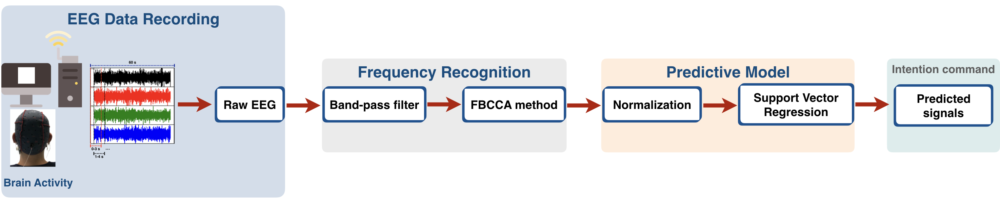

## A Single-Channel Consumer-Grade EEG Device for Brain-Computer Interface: Enhancing Detection of SSVEPs and Its Amplitude Modulations

***Abstract->*** Brain-computer interfaces (BCIs) are one of a few promising technologies that can help patients who are suffering from neuromuscular disorders. As an implementation of BCIs, steady-state visually evoked potentials (SSVEPs) have been widely used for many practical applications due to its high signal-to-noise ratio. Several studies have focused on developing algorithms for SSVEPs-based frequency recognition; however, those algorithms do not precisely predict the modulation of SSVEP amplitude, known to change as a function of stimulus luminance contrast. In this study, we aim at developing an integrated approach to estimate the frequency and contrast-related amplitude modulations of the SSVEP signal, simultaneously. In order to achieve that, we developed a behavioral task in which human participants looked at a visual target flicking at 7.5 Hz. Critically, across different experimental conditions, the luminance contrast of the visual target can change across time in several ways, i.e. the luminance contrast remained constant, increased gradually, decreased gradually, or increased and then decreased. SSVEPs were recorded from the central occipital site using OpenBCI, an open-source and low-cost consumer-grade EEG device. Our results demonstrate that the filter bank canonical correlation analysis (FBCCA) performed well in SSVEP frequency recognition, while the support vector regression (SVR) outperformed the other supervised machine learning algorithms in predicting the contrast-dependent amplitude modulations of the SSVEPs. These findings indicate the applicability and efficiency of our integrated method at simultaneously predicting both frequency and amplitude of visually evoked signals, and have proven to be useful for advancing SSVEP-based applications. Code examples and other supporting materials are available on here.
