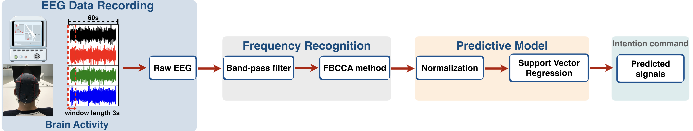
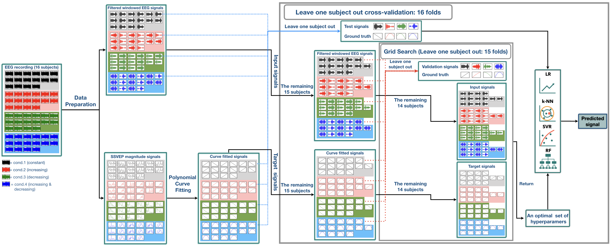

## A Single-Channel Consumer-Grade EEG Device for Brain-Computer Interface: Enhancing Detection of SSVEP and Its Amplitude Modulation

***Abstract->*** Brain-Computer interfaces (BCIs) play a significant role in easing neuromuscular patients on controlling computers and prosthetics. Due to their high signal-to-noise ratio, steady- state visually evoked potentials (SSVEPs) has been widely used to build BCIs. However, currently developed algorithms do not predict the modulation of SSVEP amplitude, which is known to change as a function of stimulus luminance contrast. In this study, we aim to develop an integrated approach to simultaneously esti- mate the frequency and contrast-related amplitude modulations of the SSVEP signal. To achieve that, we developed a behavioral task in which human participants focused on a visual flicking target which the luminance contrast can change through time in several ways. SSVEP signals from 16 subjects were then recorded from electrodes placed at the central occipital site using a low- cost, consumer-grade EEG. Our results demonstrate that the filter bank canonical correlation analysis (FBCCA) performed well in SSVEP frequency recognition, while the support vector regression (SVR) outperformed the other supervised machine learning algorithms in predicting the contrast-dependent ampli- tude modulations of the SSVEPs. These findings indicate the applicability and strong performance of our integrated method at simultaneously predicting both frequency and amplitude of visually evoked signals, and have proven to be useful for advancing SSVEP-based applications.

 
<b>Fig. 1</b> The design of the structure for simultaneously estimating the frequency and amplitude modulations of SSVEP signals. 

 
<b>Fig. 2</b> Architecture of leave-one-subject-out cross-validation (LOCV) with the grid search algorithm for training of the model. 

